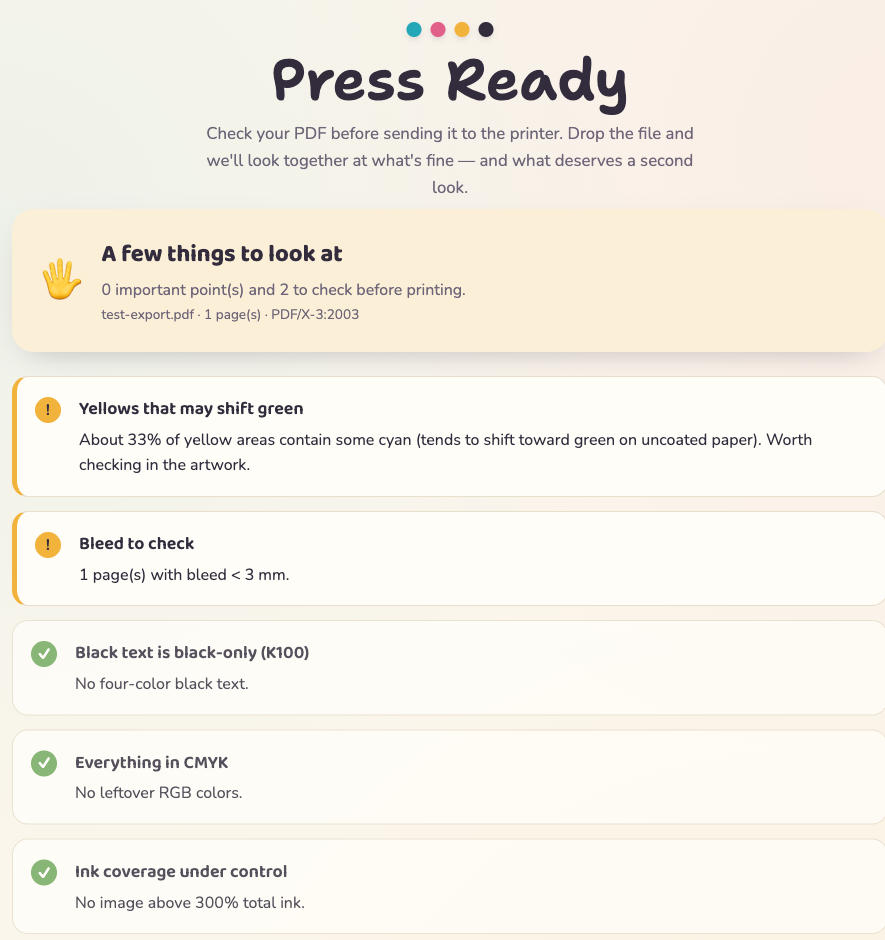

  

<h1 align="center">Press Ready</h1>

<em>Check your PDF before it goes to the printer.</em>

  

---

Drop a PDF. See what's print-ready — and what needs a second look.
No install. Nothing leaves your computer.

### What it checks

- Black text built from four inks (should be K100)
- Too much ink (total coverage)
- Low-resolution images
- Leftover RGB colors
- Yellows that may shift green
- Missing fonts and bleed

### Private by design

Everything runs in your browser via WebAssembly.
Your file is never uploaded anywhere.

### Use it

Open the page, drop a PDF, read the report.
Save the report as a PDF to share it.

### Host it (GitHub Pages)

**Settings → Pages → Deploy from a branch → `main` / `root`.**
Then it's live at `https://YOUR-ACCOUNT.github.io/press-ready/`.

### Built with

Pyodide · PyMuPDF · Pillow · numpy — all in the browser.
